# CirKit E-Commerce Platform

CirKit is a premium, high-performance electronics e-commerce storefront built with modern web technologies. It features a complete customer purchasing flow and a powerful, data-rich administrative dashboard designed with a sleek "dark tech" aesthetic.

---

## 📸 Screenshots

### Storefront Experience

<b>View Storefront Highlights</b>

 

**1. Hero & Navigation**
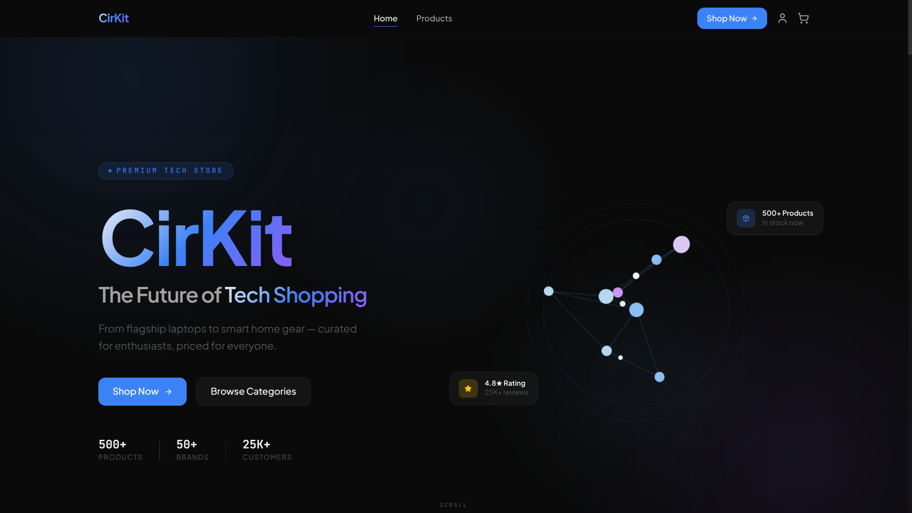

**2. Why Choose Us**
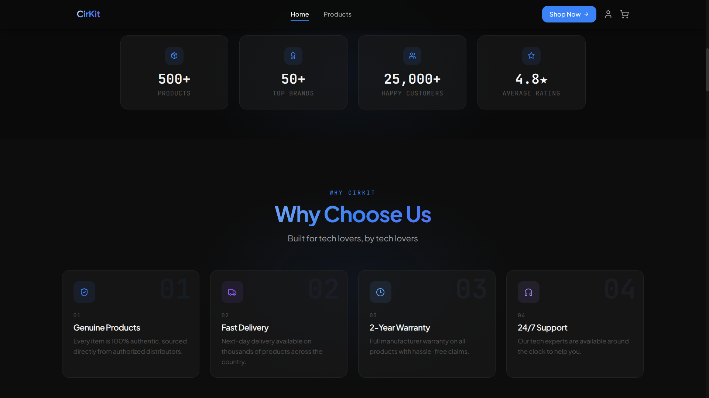

**3. Featured Products**
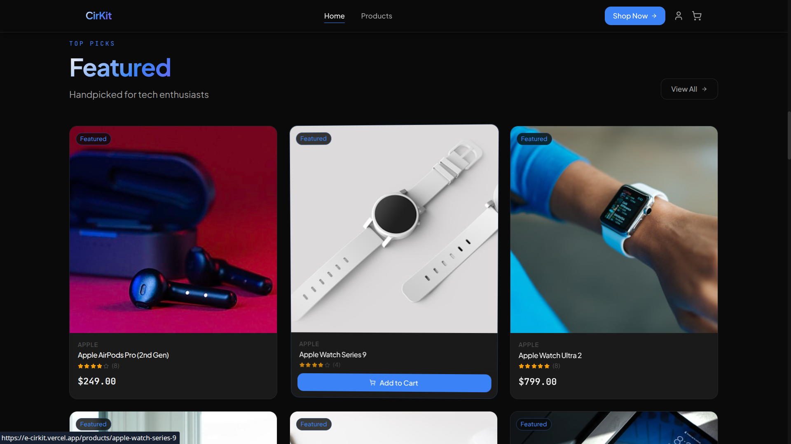

**4. Deal of the Day**
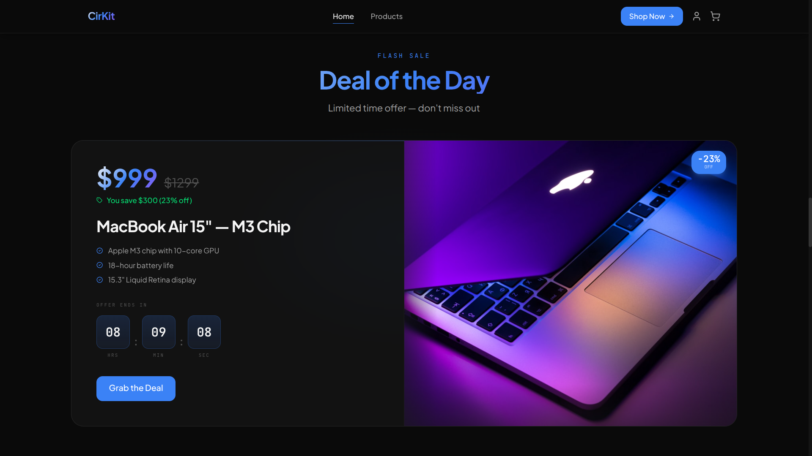

**5. Browse Categories**
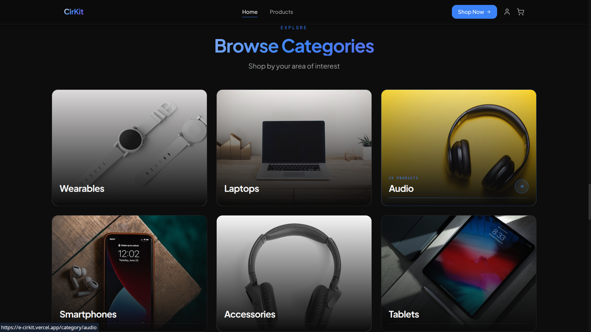

**6. New Arrivals**
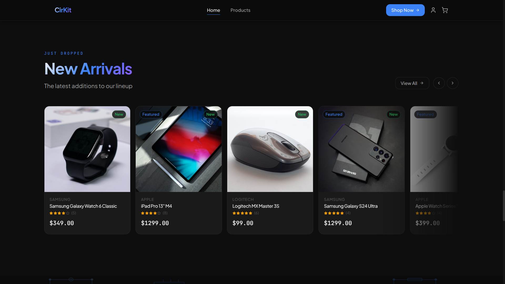

**7. Customer Reviews**
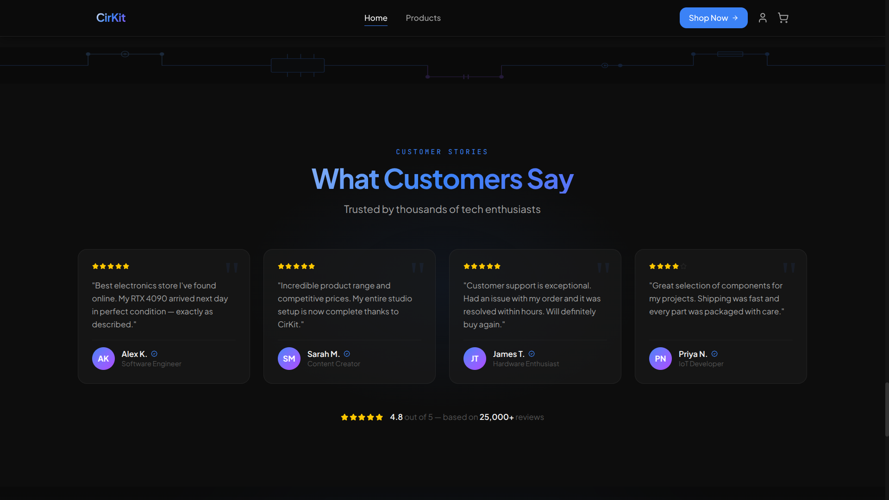

**8. Product Catalog**
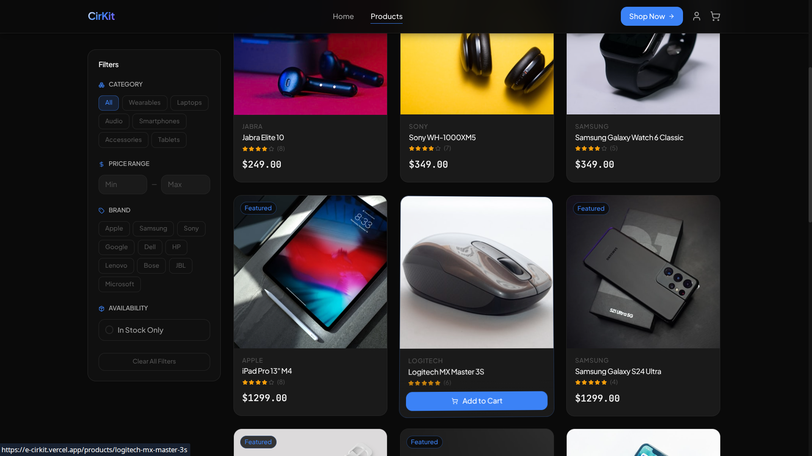

**9. Shopping Cart**
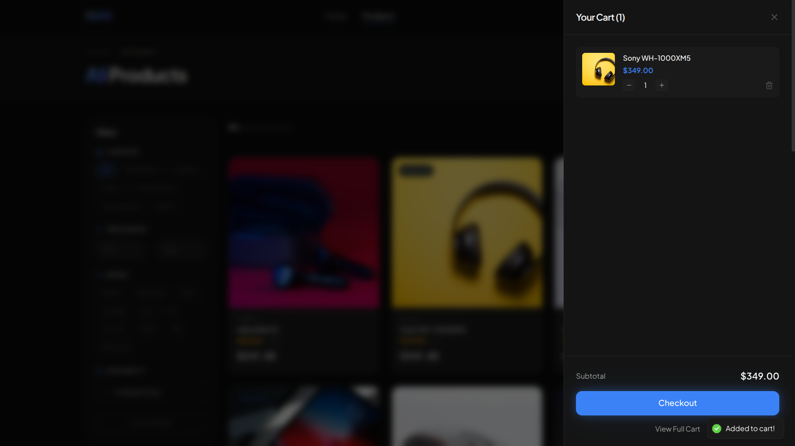
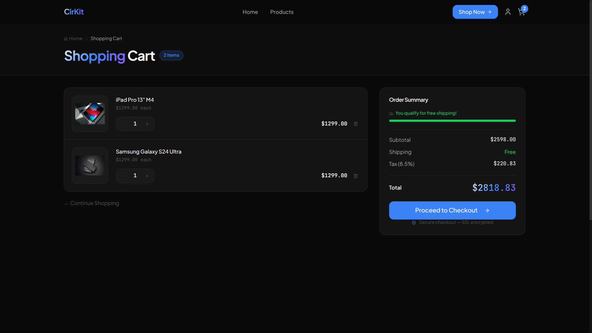

### Administration Panel

<b>View Admin Highlights</b>

 

**1. Analytics Dashboard**
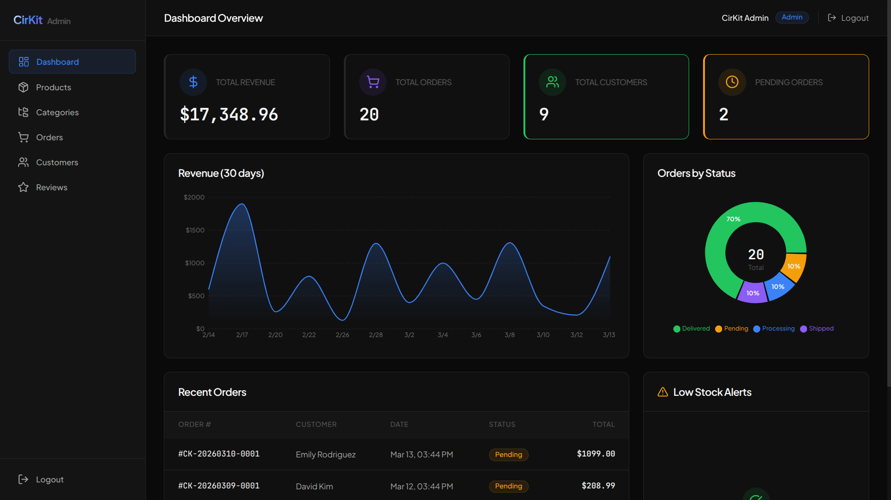

**2. Product Management**
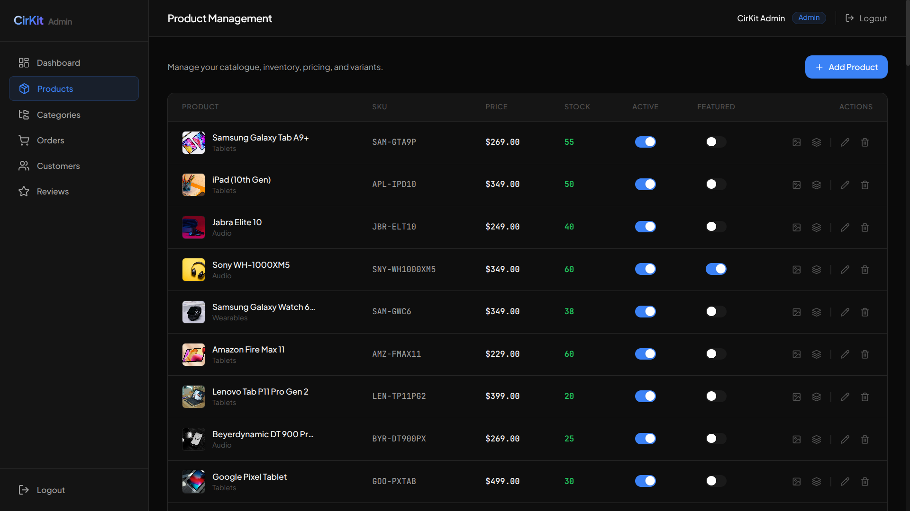

**3. Order Fulfillment**
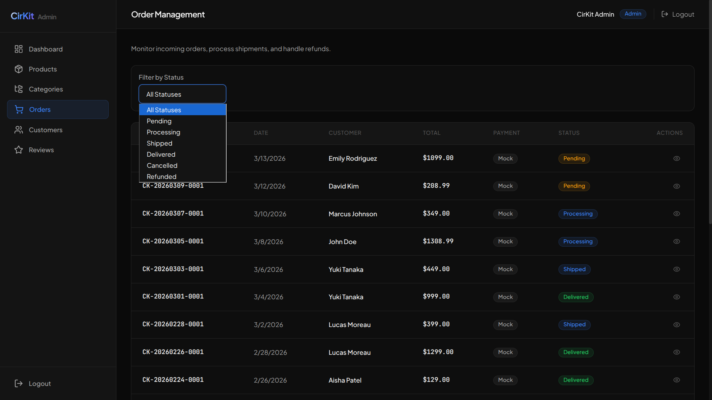

---

## 🛠️ Technology Stack

### Frontend (Vercel)
- React 19 + TypeScript + Vite
- Tailwind CSS v4 (Custom Dark Theme + Glassmorphism)
- React Router v7
- TanStack React Query v5 (Data Fetching & Caching)
- React Hook Form + Zod (Validation)
- Recharts (Admin Dashboards)
- Lucide React (Iconography)

### Backend (Railway)
- .NET 10 ASP.NET Core Web API
- C# 13 + Clean Architecture
- Entity Framework Core + PostgreSQL
- Minimal APIs + MediatR (CQRS Pattern)
- JWT Authentication

---

## 🚀 Deployment Guide

This project is configured for cloud deployment on Vercel (Frontend) and Railway (Backend).

### 1. Backend (Railway)
The backend is completely dockerized. 

1. Link your repository to Railway.
2. Railway will automatically detect the `Dockerfile` and `railway.json`.
3. Provision a **PostgreSQL** database inside your Railway environment.
4. Set the following Environment Variables in Railway:
   - `DEFAULTCONNECTION`: Your PostgreSQL connection string.
   - `JWT_SECRET_KEY`: A strong 256-bit+ secure key.
   - `JWT_ISSUER`: `CirKit`
   - `JWT_AUDIENCE`: `CirKitUsers`
   - `CORS_ORIGIN`: Your deployed Vercel URL (e.g., `https://cirkit.vercel.app`).
5. Deploy. The backend will automatically run migrations and seed the database on the first boot.

### 2. Frontend (Vercel)
The frontend is a lightweight Vite SPA.

1. Import the `/frontend` directory to Vercel.
2. Vercel will automatically detect the Vite build settings.
3. Add the following Environment Variable in Vercel:
   - `VITE_API_URL`: Your deployed Railway backend URL (e.g., `https://cirkit-api.up.railway.app/api`).
4. Deploy. The `vercel.json` file handles all SPA history fallback routing automatically.

---

## 📖 Documentation
Detailed architectural and product documentation can be found in the `/docs` directory:
- [API Documentation](./docs/API.md)
- [System Architecture](./docs/ARCHITECTURE.md)
- [Product Requirements](./docs/PRD.md)
- [Software Specifications](./docs/SRS.md)
